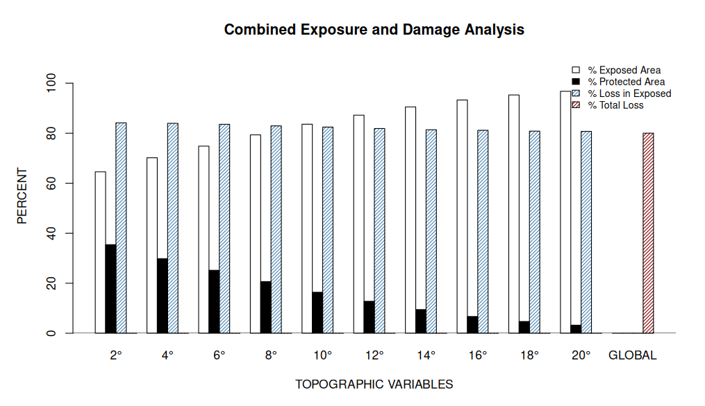

```{r setup, include=FALSE}
knitr::opts_chunk$set(echo = TRUE)
```

## Semaine 11 (23-27/03)

### Objectifs

-   Etablir des petites zones d'études
-   Faire le masque de forêt
-   Faire le modèle type Kurt McLaren

### Masque de forêt

Les masques de forêts disponibles grâce aux travaux de Thani permettent d'avoir une petite zone d'étude de "forêt publique" ou de "parc ou réserve". J'ai en premier lieu fait avec seulement "forêt publique" et, couplé aux données NDVI disponibles en décembre et janvier, il ne reste seulement quelques zones disponibles.

```{r masqué, echo=FALSE}
library(slickR)

mes_photos <- c("/home/abiton/Documents/Report-Internship/images/decmasked.png","/home/abiton/Documents/Report-Internship/images/janmasked.png","/home/abiton/Documents/Report-Internship/images/demmasked.png" )

slickR(obj = mes_photos, height = 400, width = "100%") + 
    settings(
    dots = TRUE, 
    autoplay = TRUE, 
    autoplaySpeed = 3000,
    slidesToShow = 2,   
    slidesToScroll = 1   
  )

```

J'ai pu en extraire quelques données quantitatives récapitulatives : - Altitude - Longitude - Latitude - Vitesse Maximale au cours du cyclone - Exposition topographique (pour différents angles allant de 6 à 20°) - Pente - Différence de NDVI (janvier - décembre)

Grâce à cela, quelques métriques et premiers modèles émergent.

### Modèle type Kurt McLaren

Le modèle utilisé par Kurt McLaren (<https://doi.org/10.1016/j.agrformet.2019.107621>) est comme un indice de vulnérabilité d'exposition décrit comme ceci :$(sum(vitesse_i * exposure_i))/n$ avec n le nombre total de lieux d'intérêt et i l'indice d'un de ces lieux.

J'ai donc calculé cet indice tel que i soit un pixel et n le nombre de pixels disponibles.

De plus, dans cet article, les auteurs mentionnent un angle de 20° (angle d'ouverture de canopée) qui serait utilisé aussi en Jamaique par *Boose et al. (1994)*. J'ai donc regardé le % de zones exposées, de zones protégées ainsi que le % de dégâts en fonction de la zone dans laquelle elle se situe (exposées ou protégée)



```{r dta, include = FALSE}
dta <- read.table("/home/abiton/Documents/scriptR tests/datasummary.csv", sep = ",", header = T)
```

```{r ev}
# compute EV as Kurt McLaren
n <- nrow(dta)
ev <- sum(dta$msw_max * dta$ang6, na.rm = TRUE) / n
print(ev)

ev/mean(dta$ang6)
mean(dta$msw_max)

```

Cela suggère que la vitesse maximale moyenne du cyclone (MSW) sur la zone est d'environ 53.02 m/s.  La moyenne des vitesses maximale est de 52.69 m/s donc globalement, l'exposition a accentué l'impact du cyclone sur la zone. 

```{r models}
# model kurt mclaren 
mkurt <- lm(perte_ndvi ~ msw_max * ang6, data = dta)
summary(mkurt)
```

-   effet de la vitesse seule : À chaque fois que le vent augmente de 1 m/s , le NDVI diminue de 0.03 unités.
-   effet de l'exposition topo seul : pas trop interprétable car considère un vent nul ce qui n'arrive pas lors du cyclone. 
-   effet de l'interaction : L'effet destructeur du vent est accentué sur les versants exposés. Sur un versant face au vent (ang6 = 1), la dégradation du NDVI n'est plus de −0.030, mais elle s'additionne avec l'interaction : −0.030+(−0.026)=−0.056 donc à vitesse de vent égale, la perte de végétation est deux fois plus forte sur un versant exposé que sur un terrain plat.

### Zones d'études possibles ?

Il faut que les zones d'études soient une zone forestière avec une différence de NDVI marquée c'est-à-dire significative une exposition topographique plutôt marquée (altitude élevée, plus que pour Mbouzi).

