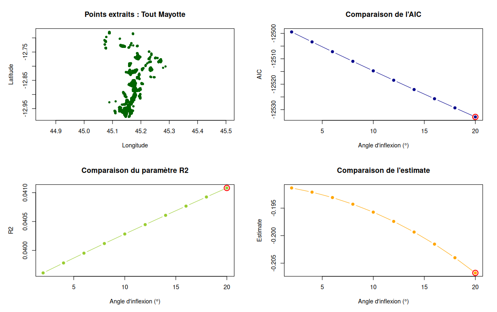
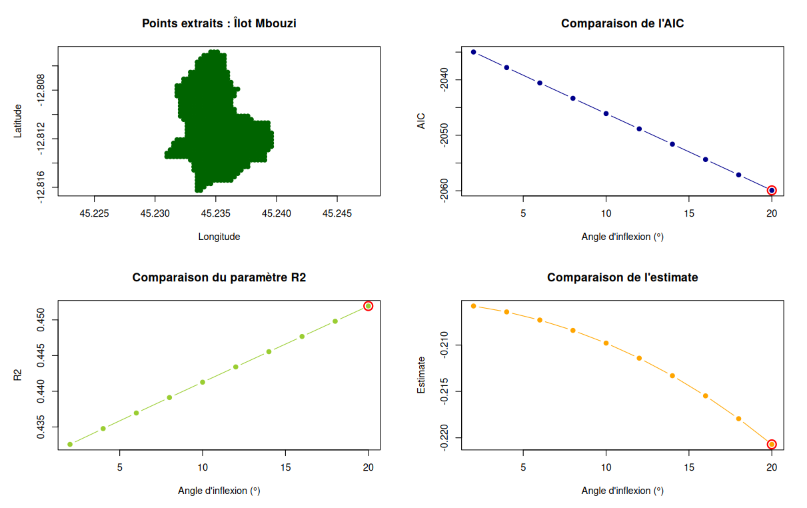

```{r setup, include=FALSE}
knitr::opts_chunk$set(echo = TRUE)
```

## Semaine 12 (30/03 au 3/04)

### Objectifs

-   Rajouter le masque de réserve et parc
-   Etudier quel angle prédit le mieux les différences de végétation
-   Faire le modèle McLaren intégré sur le temps

### Masque réserve et parc

A partir des données de Thani, on obtient un masque montrant seulement les forêts publiques et les parcs et réserves naturelles de Mayotte.

```{r prepa mask, include = FALSE}
library(terra)
library(sf)

dec  <- rast("/home/abiton/Documents/sentinel/L2A/before/decNDVI.tif")
jan  <- rast("/home/abiton/Documents/sentinel/L2A/after/janNDVI.tif")
dem  <- rast("/home/abiton/Documents/dem_data/dem_mayotte.tif")

dec_crs <- project(dec, dem)
jan_crs <- project(jan, dem)


#mask land

mask_land <- ifel(dem > 0, 1, NA)
dem_land <- dem * mask_land
dec_land <- dec_crs *mask_land
jan_land <- jan_crs* mask_land
contour_auto <- as.polygons(mask_land > 0)


forest_mask <- st_read("/home/abiton/Documents/Thani/Carto forets mayotte/forêts Mayotte/FORET_PUBLIQUE.shp")
reserve_mask <- st_read ("/home/abiton/Documents/Thani/Carto forets mayotte/forêts Mayotte/PARC_OU_RESERVE.shp")

forest_mask <- st_transform(forest_mask, crs(dem))
forest_mask <- rasterize(forest_mask, dem)

reserve_mask <- st_transform(reserve_mask, crs(dem))
reserve_mask <- rasterize(reserve_mask, dem)
full_forest_mask <- cover(forest_mask, reserve_mask)

demmasked <- dem * full_forest_mask
common_mask <- !is.na(dec_land) & !is.na(jan_land) & !is.na(demmasked)


dem_final <- mask(dem, common_mask, maskvalue = FALSE)
jan_final <- mask(jan_crs, common_mask, maskvalue = FALSE)
dec_final <- mask(dec_crs, common_mask, maskvalue = FALSE)
diff_ndvi <- jan_final - dec_final

```

```{r plot mask, echo = FALSE}

plot(dem_final, main = "DEM (Masque forêt et reserve)")
plot(contour_auto, add = TRUE, border = "black")

plot(dec_final, main = "Décembre (Masque forêt et reserve",
     col = colorRampPalette(c("steelblue", "yellow", "green4"))(100),
     range = c(-1,1))
plot(contour_auto, add = TRUE, border = "black")

plot(jan_final, main = "Janvier (Masque forêt et reserve)",
     col = colorRampPalette(c("steelblue", "yellow", "green4"))(100),
     range = c(-1,1))
plot(contour_auto, add = TRUE, border = "black")

plot(diff_ndvi, main = "Différence de NDVI (en rouge perte de végétation)",
     col = colorRampPalette(c("darkred", "white", "darkblue"))(100),
     range = c(-1,1))
plot(contour_auto, add = TRUE, border = "black")

```

### Quel angle prédit le mieux ? 

Boose et al. (1994) fixe aléatoirement un angle d'inflexion de référence à 6° tandis que celui présent dans les travaux de McLaren sont de 20° afin de calculer l'exposition topographique au vent. Il faut donc établir quel angle explique le mieux les différences de végétation après Chido. J'ai regardé un modèle très simple : 

```{r model, warning=FALSE,eval=FALSE}
lm(diffNdvi ~ angle, data = dta)
```

Où angle est une variable quantitative avec les valeurs d'exposition topographique au vent calculé avec un angle d'inflexion fixé. 
Pour prédire lequel est le mieux, j'ai fait varier entre 2 et 20° (2, 4, 6, 8, 10, 12, 14, 16, 18, 20). 

Plusieurs paramètres de modèle nous permettent de voir quel est le meilleur modèle parmi tous ces angles : 
-   AIC : plus il est faible, meilleur est le modèle
-   R² : plus il est proche de 1, meilleur est le modèle
-   Coefficient (estimate) : plus il est négatif, plus les différences de ndvi sont des pertes donc provoquent plus de dégâts. 



La zone entière de Mayotte (masqué) correspond à plus de 20 000 observations donc j'ai voulu tester sur un sous-echantillon qui est l'îlot de Mbouzi (718 observations) 



De plus, j'ai tenté avec des sous-échantillon aléatoires, les résultats sont à chaque fois similaires. 

# Modèle intégré


