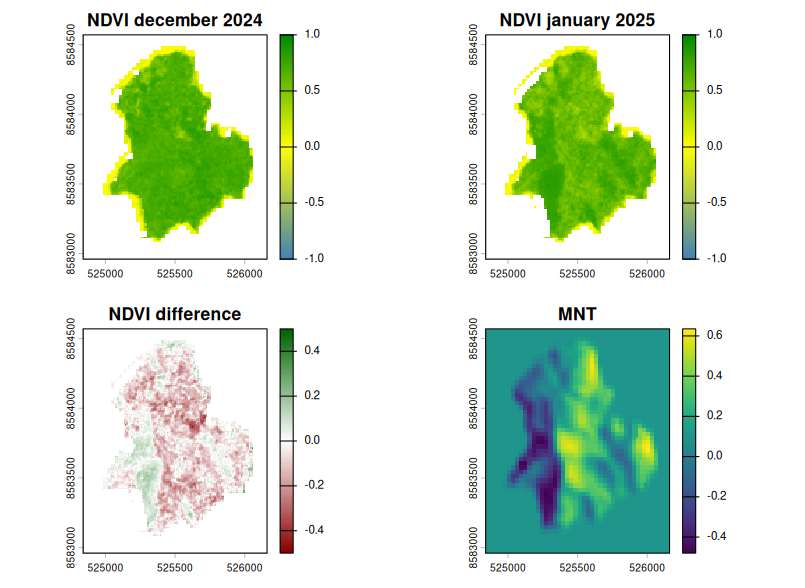
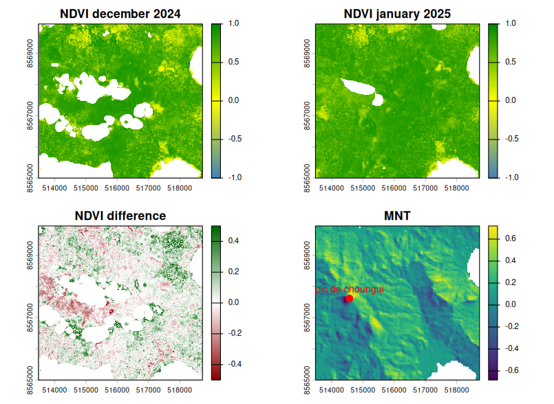
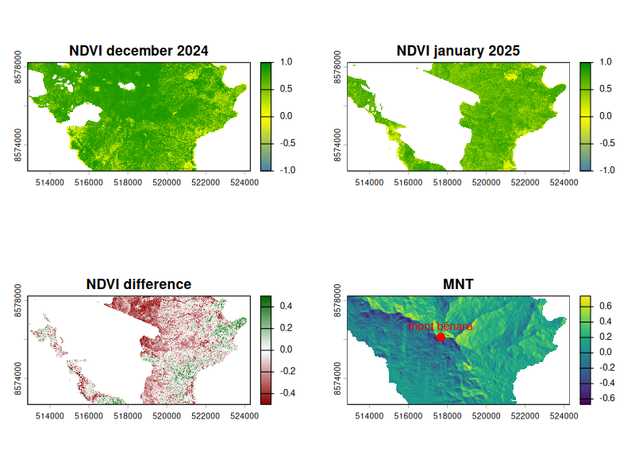

```{r setup, include=FALSE}
knitr::opts_chunk$set(echo = TRUE)
```

## Semaine 9&10 (09-20/03)

### Objectifs

-   Etablir des petites zones d'études
-   Regarder la différence de NDVI avec masque de forêt
-   Montrer quelques cartes de différences
    -   entre les images d'une période
    -   entre les différentes périodes
-   Régler l'issue de direction
-   Mettre à disposition plus de code et brouillon sur le site

### Différences de NDVI

Les cartes de différences de NDVI sont disponible dans le fichier **images brutes**. Il y a les cartes de différences entre données provenant de la même période et entre données de périodes différentes. 

-   **Différences même période** : il faut que la différence soit la plus faible possible. Si de trop grosses différences sont détectées, cela signifie que la reconstruction contient trop de variabilité et ne représente pas bien la végétation de décembre ou janvier. 
-   **Différences entre périodes** : il faut que la différence soit significative pour montrer, avant même d'étudier l'impact de Chido, qu'il y a eu un changement de végétation entre décembre 2024 et janvier 2025. 

### Zones d'études

#### **Chissioua Mbouzi**

L'îlot Chissouia Mbouzi est une réserve naturelle de 82 hectares de terres avec un sommet a 153m d'altitude donc un relief visible. Il y a 11 hectares de forêt sèche primaire.



Sur ces 4 représentations, on peut remarquer que la perte de végétation est bien située sur les zones qui ont été le plus vulnérable pendant le cyclone.

#### **Mont Choungui**

Le mont Choungui est situé dans les forêts des crètes du Sud avec un sommet à 593m d'altitude. La zone n'est pas entièrement disponible en données NDVI.



#### **Mont Bénara**

Le mont Bénara est le point culminant de l'île avec un sommet à 664 m d'altitude. Malheuresuement, une grande partie de la zone est couverte par les nuages sur les données de végétation à notre disposition. On peut le voir ici, qu'il faudrait se concentrer sur une partie plus petite de la zone.



Un point commun entre toutes ces zones est que l'on voit bien que la végétation a été impactée entre décembre 2024 et janvier 2025.

### Issue de Direction

Dans le package `StormR` la direction est "à l'envers" car elle indique la direction **towards** et ne suit pas les conventions météorologiques. Il faut donc changer les fonctions qui calculent la direction afin de résoudre ce problème et ensuite de modifier la documentation correspodante pour n'avoir aucune confusion à l'avenir. 

Une fois réglé, la direction du vent indique la provenance du vent (**from**) avec le Nord à 0° et qui se lit dans le sens des aiguilles d'une montre. 