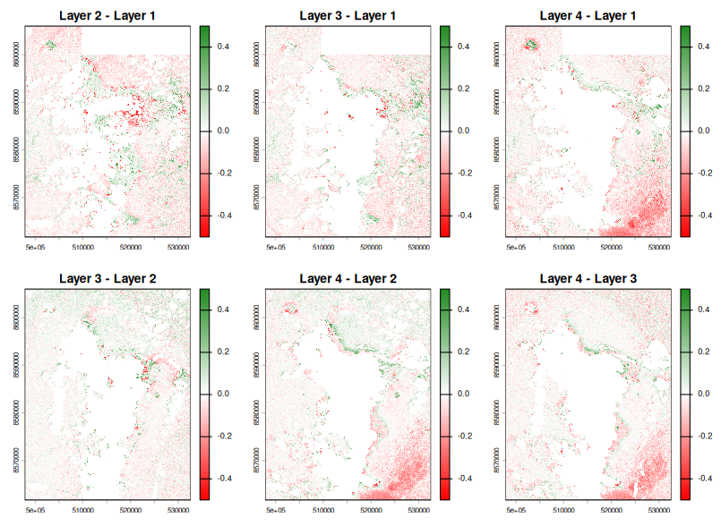
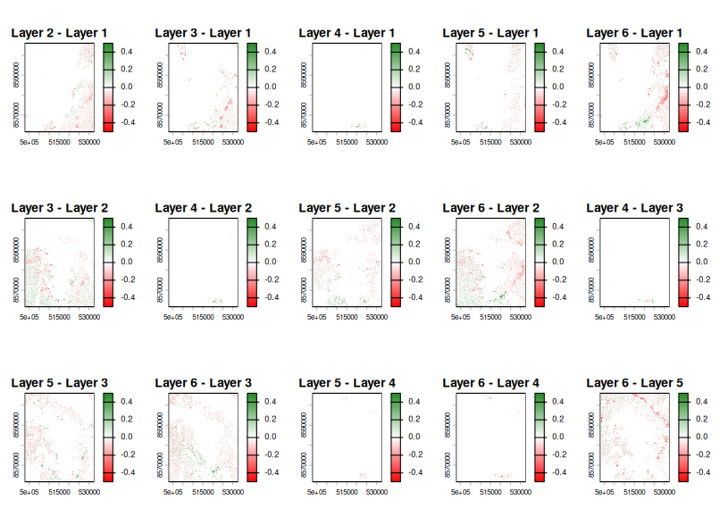
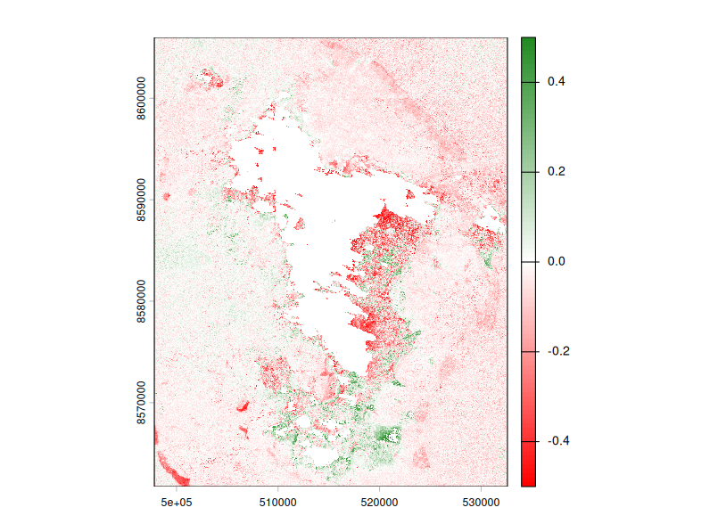
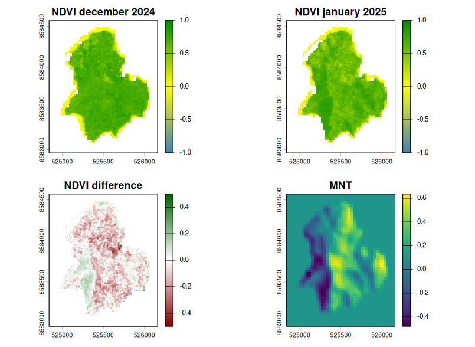
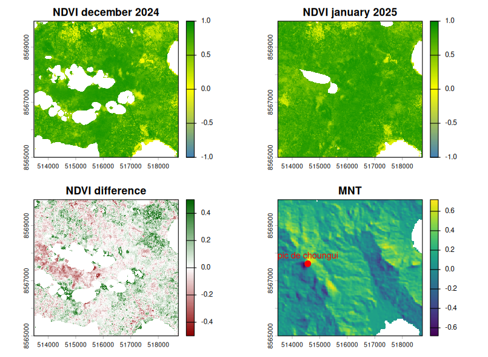
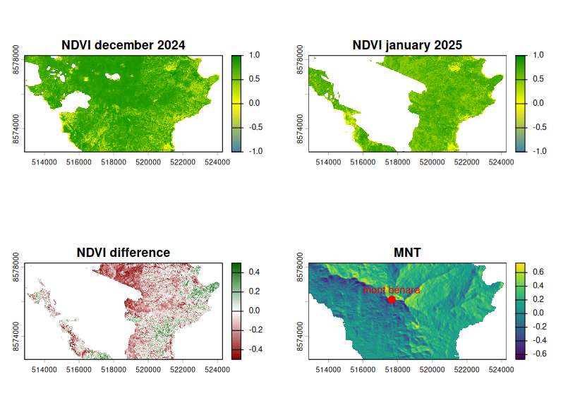
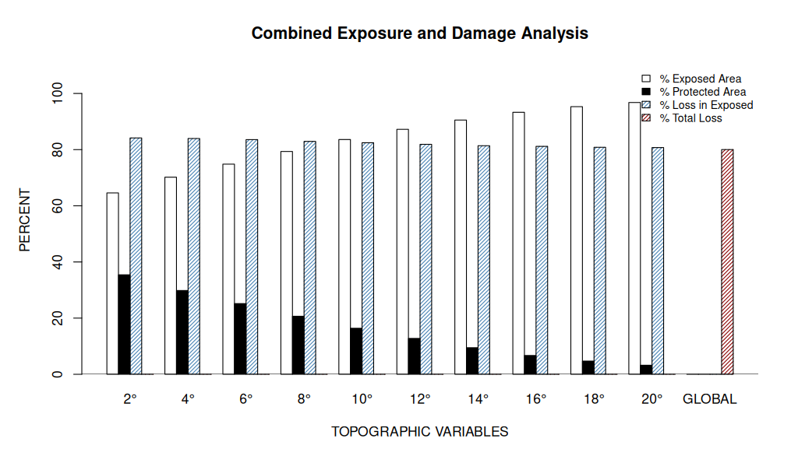

```{r setup, include=FALSE}
knitr::opts_chunk$set(echo = TRUE)
```


# Récap du mois

-   Implémentation produit `Integrated`
-   Reconstruction du NDVI et Delta NDVI
-   Melissa
-   Réparer le problème de direction de `StormR`
-   Etablissement de zones d'illustrations
-   Création du masque de forêt

## Semaine 8 (02-06/03)

### Objectifs

-   Ajouter un produit profiles par pixel
-   Ajouter un produit intégré retraçant l'exposition topographique par pixel
-   Reconstruction du NDVI de Mayotte
-   Préparer un fichier résumant Melissa (Jamaique)

### Produit PixProfiles

Le but de ce produit, est que, pour chaque pixel, on récupère la direction associée et on calcule l'exposition topographique du vent. Il renvoie donc un SpatRaster dérivé des Profiles où il y a autant de layers que d'observations. Il y a donc une direction par pixel.

Cependant `shade()` prend une seule direction en entrée donc j'ai recalculé moi-même ce que fait la fonction en se basant sur leur calcul basé qur la formule de Lambert, appliqué à la topographie. Il faut donc que le raster du MNT soit de la même taille que le raster de direction, correspondant à la loi. On fait donc un `resample` pour gérer la différence de résolution entre les deux arguments.

### Produit intégré

L'extension de ce produit est le produit intégré, où, pour chaque point, on récupère le vent le plus fort et la direction associée à cette vitesse pour en calculer l'exposition topographique au vent. On obtient un raster avec un résumé assez fiable du cyclone.

Lorsque le seuil est atteint, l'exposition topographique n'est pas calculée.

```{r summarys, echo=FALSE}
library(slickR)

mes_photos <- c("../images/summary0.png","../images/summary50.png")

slickR(obj = mes_photos, height = 400, width = "100%") + 
    settings(
    dots = TRUE, 
    autoplay = TRUE, 
    autoplaySpeed = 3000,
    slidesToShow = 2,   
    slidesToScroll = 1   
  )

```

### Reconstruction du NDVI

Afin d'essayer de recréer un produit similaire à ceux de Quarterly Mosaics, j'ai récupéré les données brutes avant et après Chido sur une période plus courte et j'ai fais la reconstruction moi-même dans la même logique que la mosaïque temporelle. Ci-dessous sont représenté la reconstruction du NDVI pour la période avant le cyclone Chido (15 Novembre au 15 Décembre) et la période après le cyclone (Janvier 2025). L'emprise totale de Mayotte n'est pas disponible à chaque fois. Les zones blanches signifient que la zone a été couverte de nuages sur toute la période considérée.

```{r mosaicsperso, echo=FALSE}
library(slickR)

mes_photos <- c("../images/sentinel/decemberNdvi.png","../images/sentinel/januaryNdvi.png")

slickR(obj = mes_photos, height = 400, width = "100%") + 
    settings(
    dots = TRUE, 
    autoplay = TRUE, 
    autoplaySpeed = 3000,
    slidesToShow = 2,   
    slidesToScroll = 1   
  )

```

### Melissa - Jamaique

En vue de la collaboration possible avec Kurt McLaren, je vais faire tourner `StormR` sur l'ouragan Melissa qui est passé sur l'ouest de la Jamaique en octobre 2025. Cet ouragan est classé catégorie 5 sur l'échelle de Saffir-Simpson. Les vents ont atteints 295 km/h en moyenne, ce qui est 100km/h de plus que Chido par comparaison. (<https://meteofrance.com/actualites-et-dossiers/actualites/louragan-melissa-frappe-la-jamaique-avant-de-toucher-cuba>)

Je vais donc faire tourner les fonctions principales de `StormR` sur ce cyclone pour avoir un petit résumé des différentes caractéristiques de ce cyclone. De plus je vais faire tourner l'exposition topographique au vent sur la Jamaique (partie ouest) afin de pouvoir montrer ce fichier à Kurt McLaren si possible.

Ce fichier sera disponible dans **Extended work** sous le nom **Melissa**.

## Semaine 9&10 (09-20/03)

### Objectifs

-   Etablir des petites zones d'études
-   Regarder la différence de NDVI avec masque de forêt
-   Montrer quelques cartes de différences
    -   entre les images d'une période
    -   entre les différentes périodes
-   Régler l'issue de direction
-   Mettre à disposition plus de code et brouillon sur le site

### Différences de NDVI

Les cartes de différences de NDVI sont disponible dans le fichier **images brutes**. Il y a les cartes de différences entre données provenant de la même période et entre données de périodes différentes.

-   **Différences même période** : il faut que la différence soit la plus faible possible. Si de trop grosses différences sont détectées, cela signifie que la reconstruction contient trop de variabilité et ne représente pas bien la végétation de décembre ou janvier.

 

-   **Différences entre périodes** : il faut que la différence soit significative pour montrer, avant même d'étudier l'impact de Chido, qu'il y a eu un changement de végétation entre décembre 2024 et janvier 2025.



### Zones d'études

#### **Chissioua Mbouzi**

L'îlot Chissouia Mbouzi est une réserve naturelle de 82 hectares de terres avec un sommet a 153m d'altitude donc un relief visible. Il y a 11 hectares de forêt sèche primaire.



Sur ces 4 représentations, on peut remarquer que la perte de végétation est bien située sur les zones qui ont été le plus vulnérable pendant le cyclone.

#### **Mont Choungui**

Le mont Choungui est situé dans les forêts des crètes du Sud avec un sommet à 593m d'altitude. La zone n'est pas entièrement disponible en données NDVI.



#### **Mont Bénara**

Le mont Bénara est le point culminant de l'île avec un sommet à 664 m d'altitude. Malheuresuement, une grande partie de la zone est couverte par les nuages sur les données de végétation à notre disposition. On peut le voir ici, qu'il faudrait se concentrer sur une partie plus petite de la zone.



Un point commun entre toutes ces zones est que l'on voit bien que la végétation a été impactée entre décembre 2024 et janvier 2025.

### Issue de Direction

Dans le package `StormR` la direction est "à l'envers" car elle indique la direction **towards** et ne suit pas les conventions météorologiques. Il faut donc changer les fonctions qui calculent la direction afin de résoudre ce problème et ensuite de modifier la documentation correspodante pour n'avoir aucune confusion à l'avenir.

Une fois réglé, la direction du vent indique la provenance du vent (**from**) avec le Nord à 0° et qui se lit dans le sens des aiguilles d'une montre.


## Semaine 11 (23-27/03)

### Objectifs

-   Etablir des petites zones d'études
-   Faire le masque de forêt
-   Faire le modèle type Kurt McLaren

### Masque de forêt

Les masques de forêts disponibles grâce aux travaux de Thani permettent d'avoir une petite zone d'étude de "forêt publique" ou de "parc ou réserve". J'ai en premier lieu fait avec seulement "forêt publique" et, couplé aux données NDVI disponibles en décembre et janvier, il ne reste seulement quelques zones disponibles.

```{r masqué, echo=FALSE}
library(slickR)

mes_photos <- c("../images/decmasked.png","../images/janmasked.png","../images/demmasked.png" )

slickR(obj = mes_photos, height = 400, width = "100%") + 
    settings(
    dots = TRUE, 
    autoplay = TRUE, 
    autoplaySpeed = 3000,
    slidesToShow = 2,   
    slidesToScroll = 1   
  )

```

J'ai pu en extraire quelques données quantitatives récapitulatives : - Altitude - Longitude - Latitude - Vitesse Maximale au cours du cyclone - Exposition topographique (pour différents angles allant de 6 à 20°) - Pente - Différence de NDVI (janvier - décembre)

Grâce à cela, quelques métriques et premiers modèles émergent.

### Modèle type Kurt McLaren

Le modèle utilisé par Kurt McLaren (<https://doi.org/10.1016/j.agrformet.2019.107621>) est comme un indice de vulnérabilité d'exposition décrit comme ceci :$(sum(vitesse_i * exposure_i))/n$ avec n le nombre total de lieux d'intérêt et i l'indice d'un de ces lieux.

J'ai donc calculé cet indice tel que i soit un pixel et n le nombre de pixels disponibles.

De plus, dans cet article, les auteurs mentionnent un angle de 20° (angle d'ouverture de canopée) qui serait utilisé aussi en Jamaique par *Boose et al. (1994)*. J'ai donc regardé le % de zones exposées, de zones protégées ainsi que le % de dégâts en fonction de la zone dans laquelle elle se situe (exposées ou protégée)



```{r dta, include = FALSE}
dta <- read.table("../data/mayotte/datasummary.csv", sep = ",", header = T)
```

```{r ev}
# compute EV as Kurt McLaren
n <- nrow(dta)
ev <- sum(dta$msw_max * dta$ang6, na.rm = TRUE) / n
print(ev)

ev/mean(dta$ang6)
mean(dta$msw_max)

```

Cela suggère que la vitesse maximale moyenne du cyclone (MSW) sur la zone est d'environ 53.02 m/s. La moyenne des vitesses maximale est de 52.69 m/s donc globalement, l'exposition a accentué l'impact du cyclone sur la zone.

```{r models}
# model kurt mclaren 
mkurt <- lm(delta_ndvi ~ msw_max * ang6, data = dta)
summary(mkurt)
```

-   effet de la vitesse seule : À chaque fois que le vent augmente de 1 m/s , le NDVI diminue de 0.03 unités.
-   effet de l'exposition topo seul : pas trop interprétable car considère un vent nul ce qui n'arrive pas lors du cyclone.
-   effet de l'interaction : L'effet destructeur du vent est accentué sur les versants exposés. Sur un versant face au vent (ang6 = 1), la dégradation du NDVI n'est plus de −0.030, mais elle s'additionne avec l'interaction : −0.030+(−0.026)=−0.056 donc à vitesse de vent égale, la perte de végétation est deux fois plus forte sur un versant exposé que sur un terrain plat.

### Zones d'études possibles ?

Il faut que les zones d'études soient une zone forestière avec une différence de NDVI marquée c'est-à-dire significative une exposition topographique plutôt marquée (altitude élevée, plus que pour Mbouzi).

