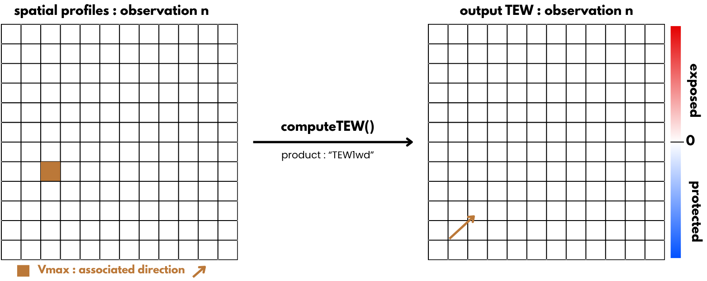
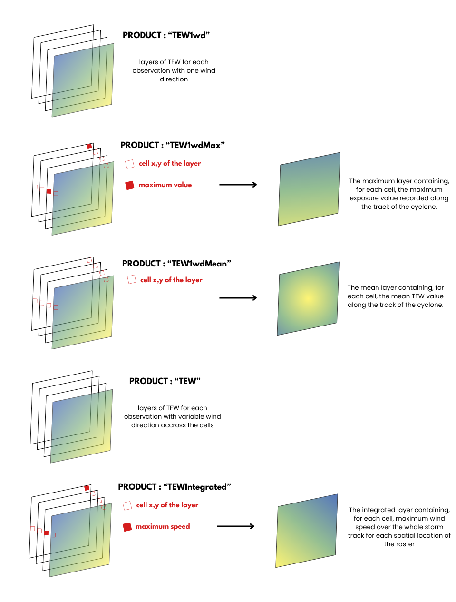

```{r setup, include=FALSE}
knitr::opts_chunk$set(echo = TRUE)
```

### Description

The `computeTEW` function allows computing topographic exposure to wind (TEW) for either :

1)  each cell of a regular grid (i.e, a raster)

or

2)  a data frame with the coordinatrs of the points of interest, for a given tropical cyclone or a set of tropical cyclones.

#### Principle

To calculate this metric from a raster, it is first necessary to retrieve the `Profiles` data from the `spatialBehaviour()` function, as well as the terrain slope (`slope)` in radians and the aspect (`aspect`) in radians (both calculated using the `terra::terrain` function).

In Ibanez et al. (2024), the function used to calculate the topographic wind exposure is `raster::hillShade()`. However, unlike `terra`, this package is not included in the dependencies of the `StormR` package. Furthermore, `terra` is a newer package designed to replace `raster`. Therefore, the `terra::shade()` function will be used instead to calculate the topographic wind exposure.

To utilize the `terra::shade()` function, an angle and a direction are required. The angle used will be the 6° inflection angle (Boose et al., 1994). For the direction, the objective is to capture the wind direction when its speed peaks within a pixel or layer (depending on the product), meaning the direction of the cell with the maximal speed ($V_{max}$).



Negative values represent areas sheltered from the wind, whereas positive values represent areas exposed to the wind.

#### Parameters

Parameters of this function are :

-   **profiles** : `SpatRaster` or `list`. Wind speed and direction prodiles from `spatialBeahviour()` or `temporalBehaviour()`.
-   **sts** : `StormList` object containing cyclone(s).
-   **dtm** : `SpatRaster`of the elevation data (Digital Terrain Model) for a given location (.tif file)
-   **angle** : inflection angle of the wind (in degrees), default is 6°.
-   **threshold** : minimum wind speed threshold (in m/s) requirred to compute exposure, default is 0.
-   **product** : desired output statistics
-   **verbose** whether or not the function should display information about the process and/or outputs (0, 1 or 2).

If the function is used with **temporal data**, parameters are not the same,there is no argument `product` and there is the parameter `points` to put instead of `sts` :

-   **points** : `data.frame`consisting of two columns names as "x" (for the longitude) and "y" (for the latitude), providing the coordinates in decimal degrees of the point locations. Same as "points" argument of the `temporalBehaviour()` function.

#### Outputs

The spatial outputs of this function depend on the product specified in its input parameters. Here are the different products :

**"TEW1wd"** which compute TEW at each observation, with one wind direction taken where wind speed is maximal. Good if your loi is small as wind is considered spatially homogeneous. Each observation have the following terminology: *STORM_TEW1wd_n*

**"TEW1wdMax"** which compute "TEW1wd", then take the maximum of the layers, following the terminology : *STORM_TEW1wd_Max*

**"TEW1wdMean"** which compute "TEW1wd", then take the mean of the layers, following the terminology : *STORM_TEW1wd_Mean*

**"TEW"** which compute TEW at each observation, where wind direction varies spatially across the loi. Each observation have the following terminology : *STORM_TEW_n*

**"TEWIntegrated"** which compute TEW for maximum wind speed over the whole storm track for each spatial location of the raster. Use wind direction associated with the maximal wind speed. This output have the following terminology : *STORM_TEW_Integrated*



### Example : Chido

Sur le cas du cyclone Chido, j'ai récupéré l'exposition topographique au vent pour chaque mesure prise dans mon loi (location of interest) qui est la zone de Mayotte (\~300km). Cette exposition topographique est décrite comme une variable quantitative **"TEW"** et peut être lue comme un indice d'exposition au vent pour chaque cellule d'une grille (un raster).

```{r include=FALSE}
library(terra)
devtools::load_all("/home/abiton/Documents/StormR")

```

```{r, echo = FALSE, results = 'hide'}
dtm <- rast("../data/mayotte/dem_mayotte.tif")

sds <- defStormsDataset(
  filename = "~/Documents/ibtracs.ALL.list.v04r01.csv",
  fields =c(names = "NAME", seasons = "SEASON", isoTime = "ISO_TIME",
            lon = "LON", lat = "LAT", msw = "USA_WIND", basin = "BASIN",
            rmw = "USA_RMW", pressure = "USA_PRES", poci = "USA_POCI"),
  basin = "SI",
  seasons = c(2023,as.numeric(format(Sys.time(),"%Y"))),
  verbose = 1
)

#get the loi
map_subunits <- sf::st_read("../data/storm/ne_10m_admin_0_map_subunits/ne_10m_admin_0_map_subunits.shp")
which(map_subunits$SUBUNIT=="Mayotte")
loiSf <- map_subunits[264,]$geometry |> sf::st_as_sf()

#get chido
sts <- defStormsList(
  sds = sds,
  loi = loiSf,
  names = c("CHIDO")
)

```

```{r results= "hide", warning = FALSE, message = FALSE}
#get spatial profiles
spProfiles <- spatialBehaviour(sts, product = "Profiles", verbose = 0)

```

Once the storm data and spatial profiles computed, we can compute TEW :

```{r}
pf <- computeTEW(spProfiles, sts, dtm, product = "TEWIntegrated", verbose = 0)
pf
```

We can finally visualise the TEW thanks to the `plotTEW`function :

```{r}
plotTEW(sts, pf$CHIDO_TEW_Integrated, dtm = dtm)
```

For more information about the `computeTEW` function, access this link : <https://umr-amap.github.io/StormR/articles/index.html>
