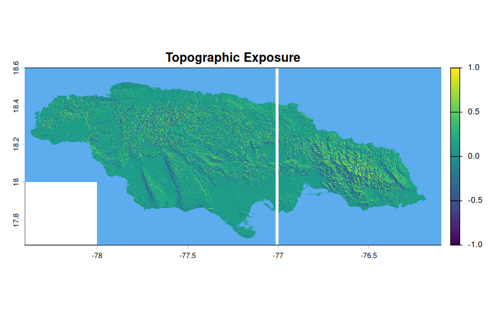
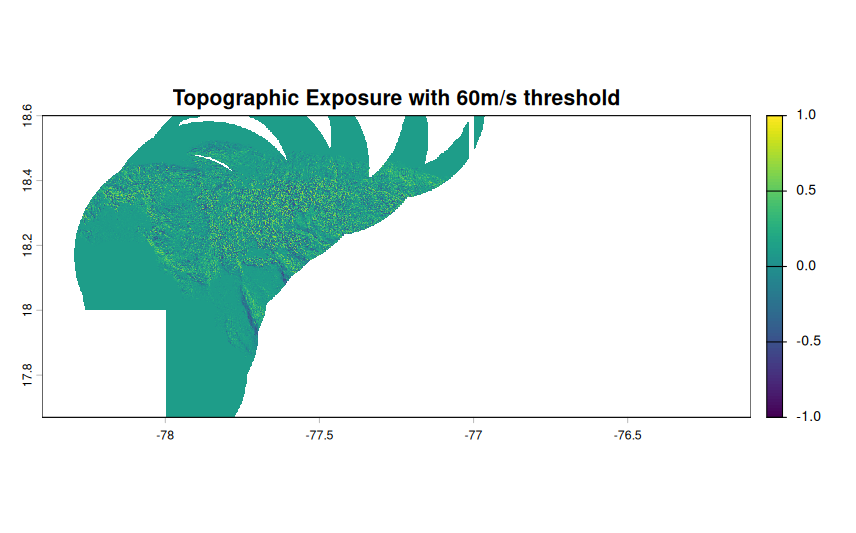

```{r setup, include=FALSE}
knitr::opts_chunk$set(echo = TRUE)
```

## Characteristics

In view of the possible collaboration with Kurt McLaren, I will run `StormR` on Hurricane Melissa, which passed over western Jamaica in October 2025. This hurricane is classified as a Category 5 on the Saffir-Simpson scale. Winds reached an average of 295 km/h, which is 100 km/h faster than Chido by comparison. (<https://meteofrance.com/actualites-et-dossiers/actualites/louragan-melissa-frappe-la-jamaique-avant-de-toucher-cuba>)

## Hurricane extraction

IBTrACS data base allowed us to have access to hurricane's information. I established a location of interest of 50 km around Jamaica.

```{r extraction, echo=FALSE, warning=FALSE,message =FALSE, results='hide'}
library(StormR)
sds_mel <- defStormsDataset(filename = "~/Documents/IBTrACS.NA.v04r01.nc", verbose = 0)

map_subunits <- sf::st_read("/home/abiton/Téléchargements/ne_10m_admin_0_map_subunits/ne_10m_admin_0_map_subunits.shp")
which(map_subunits$SUBUNIT=="Jamaica")
loiSf <- map_subunits[254,]$geometry |> sf::st_as_sf()


```

```{r st}
st <- defStormsList(sds = sds_mel, loi = loiSf, maxDist = 50, name = "MELISSA", verbose =0)
```

Then we can observe the trajectory of Melissa over Jamaica. We can see it went on the west side of the island. The Maximum Sustained Wind over Jamaica were reaaly strong and classified as category 6 with MSW over 80m/s.

```{r plotstorm, echo= FALSE, fig.align='center'}
plotStorms(st, dynamicPlot= TRUE)
```

## Temporal analysis

For the temporal analysis, it is required to have points of locations. I choose three differents points :

-   **JCM** : John Crow Mountains, a massif at 1140m of altitude located at the eastern tip of the Blue and John Crow Mountains National Park. *(Luke, D., McLaren, K. & Wilson, B. 2016)*
-   **BBSFCA** : Bluefields Bay Special Fish Conservation Area, a point in the west of the island. *(McLaren, K. et al. 2024)*
-   **Center** : A point in the center of the island.

The first two points (JCM & BBSFCA) have been chosen as they are the study sites of Kurt McLaren from two of his papers and they are located at both extremities of Jamaica which give a range of damage caused by the hurricane at different points of the island.

```{r temporal, echo = FALSE}
df <- data.frame(x = c(-76.24,-78.02,-77.3), y = c(18.4,18.10,18.2))
rownames(df) <- c("JCM", "BBSFCA","Center")
TS <- temporalBehaviour(st, points = df, product = "TS", verbose = 0)
EXP <- temporalBehaviour(st, points = df, product = "Exposure", tempRes = 30, verbose = 0)
```

```{r plotTemporal, echo = FALSE}
par(mfrow=c(1,2))
plotTemporal(data=TS, storm="MELISSA")
plotTemporal(data=TS, storm="MELISSA", var = "direction")
```

As we can see in the MSW plot, winds on the west were the strongest with over 70m/s maximum and were the weakest in the mountains with only 25m/s maximum. The great decreasing at 17:00 on the 28th of October is the passage of the eye of the storm near the point.

We can also observe the wind direction at each location point. Up until 5PM, the wind is directed toward North and North-West for every point. Then it shift between 5PM and 7PM where the eye of the storm arrive on the island. Wind then stabilize and is from the east to southeast.

The duration of exposure of the different points can be observed in the `Exposure` product in the `temporalBehaviour` function.

```{r exposuretemp, echo = FALSE}
EXP
```

The BBSFCA point is the more exposed to strong winds. JCM was not exposed for long.

## Spatial analysis

```{r spatial}
sp <- spatialBehaviour(st, product = c("Profiles","MSW"),verbose = 0)
```

The function `spatialBehaviour` give us information on each observation in the profiles as we can see below. The first plot show the radial wind speed for one observation whereas the right plot show the maximum wind speed in the loi for all the hurricane. We can see the trajectory as well as the intensity of the hurricane.

```{r spatialplot, echo = FALSE}
par(mfrow=c(1,2))
plotBehaviour(st, sp$MELISSA_Speed_61)
plotBehaviour(st, sp$MELISSA_MSW)
```

## Topographic exposure

Thanks to the package openEO and a connection to copernicus, we can extract the topographic information in Copernicus DEM 30 of Jamaica, at 30m of resolution.

I don't know why there is a whit strip in the middle of the island, but it's during the extraction of dem. Maybe it's too big, problem to solve...




 This image show the result of the integrated product **Summary** of the `computeExposure` function I've been developing for my internship. This function compute, for each point of the MNT, the topographic exposure to wind when there was the maximum speed wind. 
 
 It's searching the maximum wind speed for each point and get the associated direction to compute the topographic exposure to wind. We can say that it links the vulnerability of the terrain (exposure) to the precise moment when the danger is greatest (maximum speed) for each point on the map.
 
 We can also use this function with a `threshold`. Here for example I ran the function with a 60m/s threshold which means that only the area of the island who were exposed to winds greater than 60m/s were computed. 
 
 