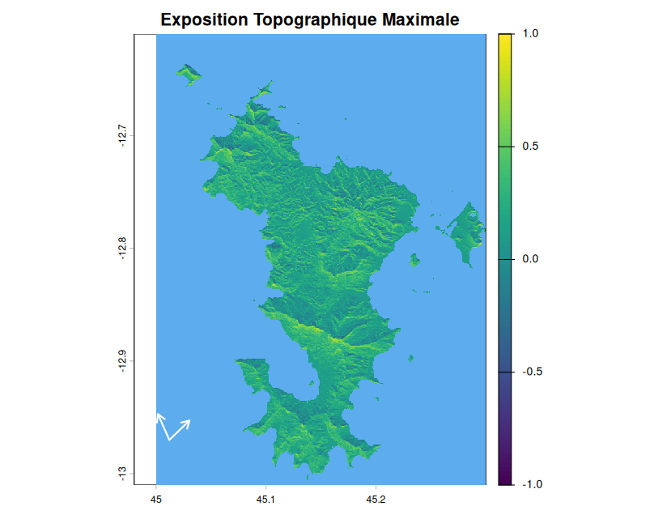

```{r setup, include=FALSE}
knitr::opts_chunk$set(echo = TRUE)
```

## Fonction computeExposure( )

Le principe de la fonction qui permet de calculer l'exposition topographique au vent est expliqué en détails dans l'onglet "Exposition Topographique" avec l'explication des outputs

```{r getData, include=FALSE}
library(terra)
dem <- rast("/home/abiton/Documents/dem_data/mayotte_dem_glo30.tiff")

devtools::load_all("/home/abiton/Documents/StormR")
sds <- defStormsDataset(
  filename = "~/Documents/ibtracs.ALL.list.v04r01.csv",
  fields =c(names = "NAME", seasons = "SEASON", isoTime = "ISO_TIME",
            lon = "LON", lat = "LAT", msw = "USA_WIND", basin = "BASIN",
            rmw = "USA_RMW", pressure = "USA_PRES", poci = "USA_POCI"),
  basin = "SI",
  seasons = c(2023,as.numeric(format(Sys.time(),"%Y"))),
  verbose = 1
)

#get the loi
map_subunits <- sf::st_read("/home/abiton/Téléchargements/ne_10m_admin_0_map_subunits/ne_10m_admin_0_map_subunits.shp")
which(map_subunits$SUBUNIT=="Mayotte")
loiSf <- map_subunits[264,]$geometry |> sf::st_as_sf()

#get chido
sts <- defStormsList(
  sds = sds,
  loi = loiSf,
  names = c("CHIDO")
)


#' Check inputs for computeExposure function
#'
#' @noRd
#' @param sts StormsList object
#' @param dem object
#' @param angle numeric
#' @param product character
#' @param threshold numeric
#' @param verbose numeric
#' @return NULL


checkInputsComputeExposure <- function(sts, dem, angle, threshold, product, verbose) {
  # Checking sts input
  stopifnot("no data found" = !missing(sts))
  
  # Checking dem input
  stopifnot("no dem data found" = !missing(dem))
  
  # Checking product input
  stopifnot("Invalid product" = product %in% c("Max", "Mean", "Profiles"))
  
  # Checking threshold input
  stopifnot("Threshold must be numeric" = identical(class(threshold), "numeric"))
  stopifnot("invalid value(s) for threshold input (must be >= 0)" = threshold >= 0)
  
  # Checking angle input 
  stopifnot("Angle must be numeric" = identical(class(angle), "numeric"))
  stopifnot("invalid value(s) for angle input (must be >= 0)" = angle >= 0)
  
  # Checking verbose input
  stopifnot("verbose must be numeric" = identical(class(verbose), "numeric"))
  stopifnot("verbose must length 1" = length(verbose) == 1)
  stopifnot("verbose must be either 0, 1 or 2" = verbose %in% c(0, 1, 2))
}


#' Get wind direction in azimuth
#' 
#' @noRd
#' @param dir_meteo direction in degrees (0-360, 90 = North)
#' 
#' @return azimuth direction (0-360, 0 = North)

convertAzimuth <- function(dir_meteo) {
  if (is.na(dir_meteo)) {
    return(NA)
    } 
  
  azimuth <- 90 - dir_meteo
  if (azimuth < 0){
    azimuth <- azimuth + 360
  } 
  
  return(azimuth)
}

#' Get the direction value from maximum speed
#' 
#' @noRd
#' @param ref_layer speed layer from profile (type. NAME_Speed_n)
#' @param target_layer direction layer (type. NAME_Direction_n)
#' 
#' @return value of the direction in degrees

getValueMaxSpeed <- function(target_layer, ref_layer) {
  id_cell <- terra::where.max(ref_layer)[1,"cell"]
  val <- as.numeric(target_layer[id_cell])
  
  return(val)
}


#' Get final direction 
#' 
#' @noRd
#' @param speed_layer speed layer from profile (type. NAME_Speed_n)
#' @param dir_layer direction layer from profile (type. NAME_Direction_n)
#' 
#' @return direction in azimuth

getWindDirection <- function(speed_layer, dir_layer) {
  dir_brut <- getValueMaxSpeed(dir_layer, speed_layer)
  dir <- convertAzimuth(dir_brut)
  
  return(dir)
}

#' Get terrain data
#' 
#' @noRd
#' @param dem File of elevation data .tif 
#' 
#' @return compute slope and aspect

getTerrain <- function(dem) {
  list(
    slope = terra::terrain(dem, v = "slope", unit = "radians"),
    aspect = terra::terrain(dem, v = "aspect", unit = "radians")
  )
}


#' Compute the topography 
#' 
#' @noRd
#' @param slope SpatRaster with slope values (in radians)
#' @param aspect SpatRaster with aspect values (in radians)
#' @param angle inflection angle of the wind (in degrees)
#' @param direction wind direction (in degrees)
#'
#'@return SpatRaster of the topography

computeTopo <- function(slope, aspect, angle = 6, direction) {
  if (is.na(direction)){
    return(NULL)
  }
  
  exp_rast <- terra::shade(slope, aspect, angle, direction)
  
  return(exp_rast)
}

#' Compute Profiles Exposure
#' 
#' @noRd
#' @param pf SpatRaster. profiles from spatialBehaviour
#' @param layersMSW layers of speed from pf
#' @param layersDir layers of direction from pf
#' @param topo topography of the loi (slope and aspect)
#' @param angle numeric. angle of inflection (6°)
#' @param threshold numeric. speed threshold. default is 0
#' 
#' @return Profiles of Exposure, one layer per observation

computeExpProfiles <- function(pf, layersMSW, layersDir, topo, angle, threshold) {
  topo_list <- list()
  
  for (i in seq_along(layersMSW)) {
  
    max_speed <- terra::global(pf[[layersMSW[i]]], "max", na.rm = TRUE)[1, 1]
    
    if (!is.na(max_speed) && max_speed >= threshold) {
      
      dir_t <- getWindDirection(pf[[layersMSW[i]]], pf[[layersDir[i]]])
      exp_rast <- computeTopo(topo$slope, topo$aspect, angle, direction = dir_t)
      
      if (!is.null(exp_rast)){
        var_name <- gsub("Speed_", "Exposure_", layersMSW[i])
        names(exp_rast) <- var_name
        topo_list[[var_name]] <- exp_rast
      }
    }
  }
  
  if (length(topo_list) == 0) return(NULL)
  return(terra::rast(topo_list))
}


############################
# function computeExposure #
############################


#' Compute the topographic exposure to wind 
#' 
#' The `computeExposure()` function allows computing topographic exposure to wind
#' for each cell of a regular grid (i.e., a raster) for a given tropical cyclone 
#' or set of tropical cyclones.
#' 
#' @param sts StormsList object
#' @param dem character. Name of the .tiff file which contains elevation data for a given location. 
#' @param angle numeric. Inflection angle of the wind (in degrees). default is 6°. 
#' @param threshold numeric. Minimum wind speed threshold (in m/s) requirred to compute exposure. default is 0
#' @param product character vector. Desired output statistics:
#'   \itemize{
#'     \item `"Profiles"`, for 2D exposure at each observation,
#'     \item `"Max"`, for maximum exposure, or
#'     \item `"Mean"`, for mean exposure (default)
#'   }
#' @param verbose numeric. Whether or not the function should display 
#'        information about the process and/or outputs. Can be:
#' \itemize{
#'    \item `2`, information about the processes and outputs are displayed (default setting),
#'    \item `1`, information about the processes are displayed, pr
#'    \item `0`, no information displayed.
#' 
#' @return the function returns one layer for topographic exposure
#' for each observation or interpolated observation and each `Storm`.
#' The names of the layer follow the following terminology, the name of the storm in capital letters,
#' "Exposure", and the indices of the observation separated by underscores
#' (e.g., "PAM_Exposure_41", ...)
#' @export

computeExposure <- function(sts, dem, 
                            angle = 6, 
                            threshold = 0, 
                            product = "Mean", 
                            verbose = 2) {
  startTime <- Sys.time()
  
  checkInputsComputeExposure(
    sts, dem, angle, threshold, product, verbose
    )
  
  if (verbose > 0) cat("=== computeExposure processing ... ===\n\nInitializing data ...")
  
  topo <- getTerrain(dem)
  nbStorms <- getNbStorms(sts)
  
  # stack who will contains every storm
  finalStack <- c() 
  
  if (verbose > 0) {
    cat(" Done\n\nComputation settings:\n")
    cat("  (*) Temporal resolution: Every 60 minutes\n")
    cat("  (*) Product(s) to compute:", paste(product, collapse = ", "), "\n")
    cat("\nStorm(s):\n")
    cat("  (", nbStorms, ") ", paste(getNames(sts), collapse = ", "), "\n\n")
  }
  
  for (i in 1:nbStorms) {
    
    stormName <- getNames(sts)[i]
    
    if (verbose > 0) cat("\n --> Computing for :", stormName, "...")
    
    # extracting information for one storm 
    st <- sts
    st@data <- list(sts@data[[i]])
    
    #compute spatial profiles
    pf <- spatialBehaviour(st, product = "Profiles", verbose = 0)
    layersMSW <- names(pf)[grep("_Speed_", names(pf))]
    layersDir <- names(pf)[grep("_Direction_", names(pf))]
    
    #compute exposure profiles
    exposureStack <- computeExpProfiles(
      pf, layersMSW, layersDir, topo, angle, threshold
      )
    
    if (is.null(exposureStack)) {
      warning("No layers met the wind speed threshold for : ", stormName)
      next
    }
    
    # stack for one storm
    currentStormStack <- NULL
    
    
    if ("Profiles" %in% product) {
      currentStormStack <- exposureStack
    }
    
    if ("Max" %in% product) {
      finalStackMax <- terra::app(exposureStack, fun = "max", na.rm = TRUE)
      names(finalStackMax) <- paste0(stormName, "_Exposure_Max")
      
      if (is.null(currentStormStack)) currentStormStack <- finalStackMax 
      else currentStormStack <- c(currentStormStack, finalStackMax)
    }
    
    if ("Mean" %in% product) {
      finalStackMean <- terra::app(exposureStack, fun = "mean", na.rm = TRUE)
      names(finalStackMean) <- paste0(stormName, "_Exposure_Mean")
      
      if (is.null(currentStormStack)) currentStormStack <- finalStackMean 
      else currentStormStack <- c(currentStormStack, finalStackMean)
    }
    

    
    # stock the stack in global
    if (is.null(finalStack)) {
      finalStack <- currentStormStack
    } else {
      finalStack <- c(finalStack, currentStormStack)
    }
    
    if (verbose > 0) cat(" Done.")
  }
  
  if (is.null(finalStack)) return(NULL)
  
  
  endTime <- Sys.time()
  
  if (verbose > 0) {
    cat("\n\n=== DONE with run time", round(as.numeric(endTime - startTime), 3), "sec ===\n")
  }
  
  if (verbose > 1) {
    cat("Output:\n")
    cat("SpatRaster stack with", terra::nlyr(finalStack), "layers:\n")
    cat("index - name of layers\n")
    n <- names(finalStack)
    names(n) <- seq(1, terra::nlyr(finalStack))
    for (i in seq_along(n)) {
      cat(" ", names(n[i]), "   ", n[i], "\n")
    }
    cat("\n")
  }
  
  return(finalStack)
}

```

En testant tous les produits possibles sans seuil de vent, on obtient pour Chido, 26 layers sont calculés.

```{r expTopo}
expTopo <- computeExposure(sts, dem, angle = 6, threshold = 0,product = c("Mean","Max","Profiles"))
expTopo
```

Avec un seuil de vent à 58m/s (Catégorie 4), 22 layers sont calculés

```{r include = FALSE}
expTopo58 <- computeExposure(sts, dem, angle = 6, threshold = 58,product = c("Mean","Max","Profiles"))
```

```{r expTopo58}
expTopo58
```

## Visualisation

La visualisation de cette fonction se base sur le même principe que pltoBehaviour où on peut visualiser un layer. Ici il y a la flèche correspondant à la direction du vent lorsque l'on visualise un profil.


Pour les outputs récapitulatifs c'est-à-dire l'exposition maximale de chaque cellule du raster et l'exposition moyenne de chaque cellule du raster, les flèches correspondent à l'étendue des vents sur tout le long du cyclone.




Lorsque l'on compare avec ou sans seuil de vitesse, ici il n'y a presque pas de différence.

```{r plot-expmax, warning=F,message = F,echo = F, fig.align='center'}
diff <- expTopo$CHIDO_Exposure_Mean - expTopo58$CHIDO_Exposure_Mean
plot(diff, main = "Difference entre les deux moyennes")
```